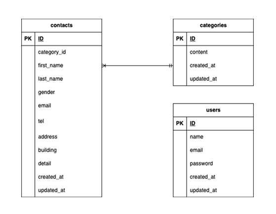

# お問い合わせフォーム

## 環境構築

Docker ビルド

1. ディレクトリを作成

2. 作成したディレクトリ以下にリポジトリをクローン  
   git clone git@github.com:kvujic/contact-form.git

3. 取得したディレクトリに移動  
   cd contact-form

4. コンテナを起動  
   docker-compose up -d --build

5. コードエディタを開く  
   code .

- MYSQL は、OS によって起動しない場合があるので、それぞれの環境に合わせて docker-compose.yml ファイルを編集してください。

Laravel 環境構築

1. PHP コンテナにログイン  
   docker-compose exec php bash

2. パッケージをインストール  
   composer install

3. .env を作成し、環境変数を変更  
   cp .env.example .env

4. APP_KEY 生成  
   php artisan key:generate

7. マイグレーションを実行  
php artisan migrate:fresh

8. シーディングを実行  
   php artisan db:seed

## 使用技術

- Laravel 8.83.29
- PHP 7.4.9
- MySql 8.0.26
- Fortify 1.19.1
- Livewire 2.12.8

## ER 図

## URL

- 開発環境：  
  http://localhost/  
  http://localhost/register/  
  http://localhost/login/  
　　　　　
- phpMyAdmin：http://localhost:8080/
